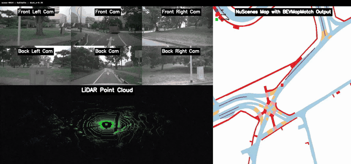

# BEVMapMatch

<p align="center">
  <strong>BEVMapMatch: Multimodal BEV Neural Map Matching for Robust Re-Localization of Autonomous Vehicles</strong><br>
  Shounak Sural and Ragunathan Rajkumar<br>
  <em>IROS 2026</em>
</p>

<p align="center">
  <a href="https://arxiv.org/abs/2603.25963"></a>
  
</p>

<p align="center">
  
</p>

Multimodal bird's-eye-view neural map matching for global vehicle
re-localization without a GNSS prior.

BEVMapMatch uses a three-stage pipeline:

1. Generate a 100 m x 100 m semantic BEV map around the vehicle.
2. Retrieve the most likely 50 m x 50 m cell from a 500 m x 500 m map.
3. Refine the location within the predicted 3 x 3 neighborhood using
   EfficientLoFTR correspondences and homography estimation.

## Requirements

- Linux
- Python 3.10 or newer
- NVIDIA GPU with CUDA support for training
- 32 GB RAM or more recommended
- nuScenes v1.0 trainval data and map expansion

## Installation

```bash
git clone --recurse-submodules https://github.com/ssuralcmu/BEVMapMatch.git
cd BEVMapMatch

python3 -m venv .venv
source .venv/bin/activate
python -m pip install --upgrade pip
python -m pip install -e '.[dev]'
```

Install a CUDA-enabled PyTorch build from
[pytorch.org](https://pytorch.org/get-started/locally/) when the default pip
installation does not match the system CUDA version.

## Download checkpoints

To run inference without training, download everything from
[BEVMapMatch Models](https://drive.google.com/drive/folders/1p133pqV2i6RiZHF30qR6LCDdoSuAWILv)
into the repository's `models/` directory. The supplied checkpoints cover CAF
segmentation with UniTR, 1/2/4/8-frame coarse retrieval, and MatchAnything
fine alignment.

The complete folder can be downloaded from the command line with:

```bash
python -m pip install gdown
gdown --folder https://drive.google.com/drive/folders/1p133pqV2i6RiZHF30qR6LCDdoSuAWILv -O models
```

After downloading, the checkpoint paths must be:

```text
models/
├── unitr_map_lss.pth
├── coarse_1frame_caf.pth
├── coarse_2frame_caf.pth
├── coarse_4frame_caf.pth
├── coarse_8frame_caf.pth
├── matchanything_eloftr.ckpt
└── bevfusion_segmentation_baseline.pth
```

Proceed directly to the inference sections below. Training is only required
when creating new checkpoints. Checksums and file purposes are listed in
`models/MANIFEST.md`.

## Download nuScenes

1. Create an account at the [nuScenes download page](https://www.nuscenes.org/nuscenes#download).
2. Accept the dataset terms.
3. Download the v1.0 trainval metadata, all trainval sensor-data archives, and
   the map expansion archive.
4. Extract every archive into `data/nuscenes` without replacing directories
   created by earlier archives.

The resulting directory must contain:

```text
data/nuscenes/
├── maps/
├── samples/
├── sweeps/
└── v1.0-trainval/
```

Verify the devkit installation:

```bash
python - <<'PY'
from nuscenes.nuscenes import NuScenes
NuScenes(version='v1.0-trainval', dataroot='data/nuscenes', verbose=True)
PY
```

## Generate CAF BEV segmentations with UniTR

The released UniTR+LSS checkpoint is the CAF segmentation checkpoint used by
this pipeline. The implementation is included in `third_party/UniTR`. Install
it in a Python 3.8 environment with CUDA 11.3:

```bash
conda create -n unitr python=3.8 -y
conda activate unitr
pip install torch==1.10.1+cu113 torchvision==0.11.2+cu113 \
  --extra-index-url https://download.pytorch.org/whl/cu113
pip install -r third_party/UniTR/requirements.txt
pip install spconv-cu113==2.1.25
pip install -e third_party/UniTR
```

Place `unitr_map_lss.pth` under `models/`, expose nuScenes to UniTR, and
generate its metadata:

```bash
mkdir -p third_party/UniTR/data/nuscenes
ln -s "$(pwd)/data/nuscenes" \
  third_party/UniTR/data/nuscenes/v1.0-trainval

cd third_party/UniTR
python -m pcdet.datasets.nuscenes.nuscenes_dataset \
  --func create_nuscenes_infos \
  --cfg_file tools/cfgs/dataset_configs/nuscenes_dataset.yaml \
  --version v1.0-trainval \
  --with_cam \
  --with_cam_gt

cd tools
```

Export CAF segmentations directly with the released UniTR checkpoint:

```bash
python test.py \
  --cfg_file cfgs/nuscenes_models/unitr_map+lss.yaml \
  --ckpt ../../../models/unitr_map_lss.pth \
  --eval_map \
  --save_map_outputs \
  --map_score_thresh 0.5
cd ../../..
```

UniTR writes predictions below
`third_party/UniTR/output/cfgs/nuscenes_models/unitr_map+lss/default/eval/`.

## Prepare map-matching data

Create the training and validation inputs:

```bash
python scripts/prepare_nuscenes.py \
  --dataroot data/nuscenes \
  --split train \
  --output data/processed

python scripts/prepare_nuscenes.py \
  --dataroot data/nuscenes \
  --split val \
  --output data/processed
```

For a quick pipeline check, prepare a small subset:

```bash
python scripts/prepare_nuscenes.py \
  --dataroot data/nuscenes \
  --split train \
  --output data/processed \
  --max-samples 128

python scripts/prepare_nuscenes.py \
  --dataroot data/nuscenes \
  --split val \
  --output data/processed \
  --max-samples 64
```

Replace the generated local-map images with the corresponding sensor-derived
UniTR predictions:

```bash
python scripts/import_unitr_segmentations.py \
  --unitr-output third_party/UniTR/output/cfgs/nuscenes_models/unitr_map+lss/default/eval/epoch_no_number/val/default/map_outputs \
  --processed-root data/processed \
  --split val
```

Prepared samples use this layout:

```text
data/processed/
├── train/
│   ├── basemaps/
│   ├── metadata/
│   └── segmentations/
└── val/
    ├── basemaps/
    ├── metadata/
    └── segmentations/
```

Validate all paths and sample triplets:

```bash
python scripts/verify_data.py --config configs/paper.yaml
```

## Configure an experiment

Experiment settings are stored in `configs/paper.yaml`.

Set `model.neighbor_frames` to select the temporal input:

| Total frames | `neighbor_frames` |
|---:|---:|
| 1 | 0 |
| 2 | 1 |
| 4 | 3 |
| 8 | 7 |

The default model uses a frozen `facebook/dinov2-large` encoder, an 8-head
cross-attention layer, and a 10 x 10 retrieval grid.

## Train the coarse matcher

```bash
python scripts/train_coarse.py \
  --config configs/paper.yaml \
  --output checkpoints/coarse.pt
```

Training writes the best checkpoint to `checkpoints/coarse.pt` and epoch
metrics to `checkpoints/coarse.history.json`.

## Run coarse inference

Select the checkpoint that matches the number of temporal frames:

```bash
python scripts/infer_coarse.py \
  --config configs/paper.yaml \
  --checkpoint models/coarse_4frame_caf.pth \
  --neighbor-frames 3 \
  --output outputs/coarse_4frame_predictions.json
```

The output contains each sample's predicted cell, ground-truth cell, class
probabilities, and source paths.

## Prepare fine-alignment pairs

```bash
python scripts/prepare_fine_pairs.py \
  outputs/coarse_4frame_predictions.json \
  --output outputs/fine_pairs
```

This creates a normalized 300 x 300 map crop, a query BEV image, and an
annotation for each validation sample.

## Run fine alignment

Clone and install MatchAnything:

```bash
git clone https://github.com/zju3dv/MatchAnything.git third_party/MatchAnything
python -m pip install -e third_party/MatchAnything
```

Run EfficientLoFTR matching and homography estimation:

```bash
python scripts/run_fine_matchanything.py \
  outputs/fine_pairs/manifest.json \
  --matchanything-root third_party/MatchAnything \
  --output outputs/distance_errors.json
```

## Evaluate localization

```bash
python scripts/evaluate.py outputs/distance_errors.json
```

The report includes Recall@1m, Recall@2m, Recall@5m, Recall@10m, mean error,
and median error.

## Run tests

```bash
pytest -q
python -m compileall -q src scripts
```

## Command summary

```bash
make install
make download-models
make prepare-train NUSCENES_ROOT=data/nuscenes
make prepare-val NUSCENES_ROOT=data/nuscenes
python scripts/verify_data.py
make infer CHECKPOINT=models/coarse_4frame_caf.pth NEIGHBOR_FRAMES=3
make fine-pairs
python scripts/run_fine_matchanything.py \
  outputs/fine_pairs/manifest.json \
  --matchanything-root third_party/MatchAnything
make evaluate
```

## Citation

```bibtex
@article{sural2026bevmapmatch,
  title={BEVMapMatch: Multimodal BEV Neural Map Matching for Robust Re-Localization of Autonomous Vehicles},
  author={Sural, Shounak and Rajkumar, Ragunathan Raj},
  journal={arXiv preprint arXiv:2603.25963},
  year={2026}
}
```
